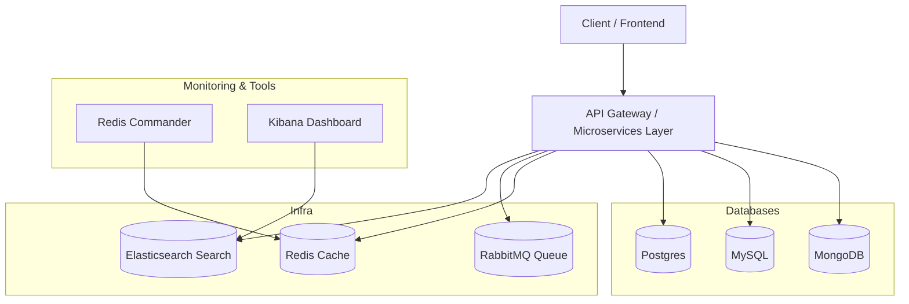

### **Summarized Architecture Diagram** :

---

### 📊 High-Level Architecture

---

### 📝 Concise Summary

* **Client** interacts through **API Gateway / Microservices**.
* **Databases (Mongo, MySQL, Postgres)** store structured & unstructured data.
* **Redis** accelerates performance with caching.
* **RabbitMQ** manages async messaging between services.
* **Elasticsearch + Kibana** handle search, analytics & visualization.
* **Redis Commander** provides a management UI for Redis.

---

⚡ In essence: Your architecture is a **microservices-based system** backed by **polyglot persistence (Mongo, MySQL, Postgres)**, **caching (Redis)**, **messaging (RabbitMQ)**, and **observability (Elastic + Kibana)**.

---
